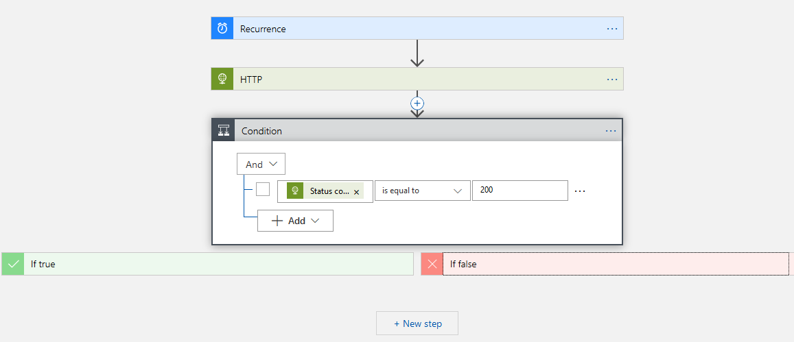
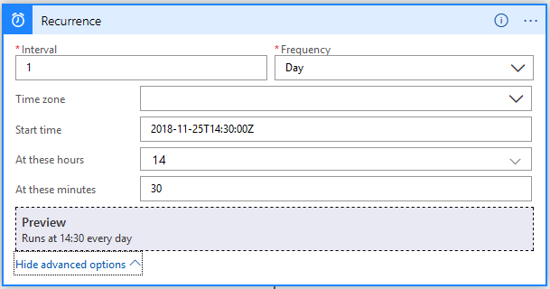
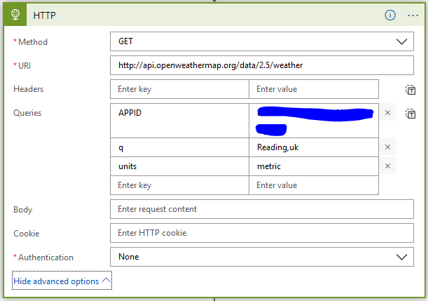
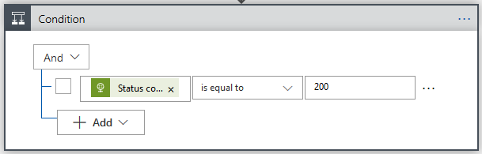
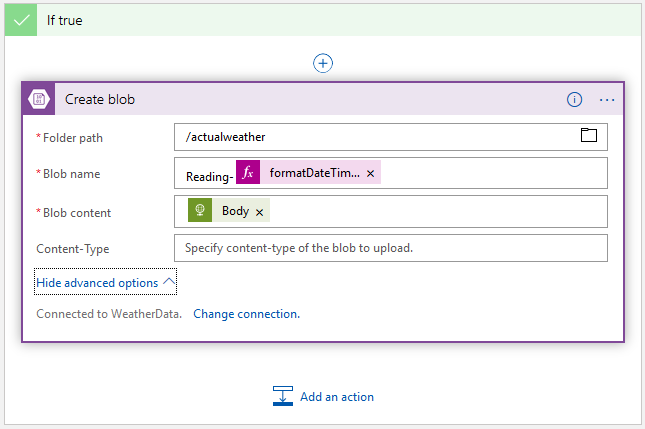

# Quick Win - Setting up a Weather Service
Produced by Dave Lusty
Head to [openweathermap](https://openweathermap.org) and sign up for API access. This will give you an API key to use when requesting data. The service is free up to certain traffic limits which we won’t hit if using it for daily updates.
 ![1.OpenWeatherMap](images/1.OpenWeatherMap.png]
You’ll need the key from this box later. I’ve covered mine in blue here as you’ll need to get your own.
*	Create a Resource Group in your Azure subscription called “Weather Data”
  *	This will encapsulate all components used to gather weather data
  *	When you no longer need weather data, delete this resource group and everything will be tidy
*	In this RG, create a storage account. The name of this doesn’t matter, but “weatherdata<yourlastname>” should work and will be easy to spot
*	Create a Logic App in the same resource group and region called “ActualWeather”
*	In the designer, we’ll be making the following structure. A timer will kick off the run every day, then call the API and write to blob if it succeeds. If not you can send a mail or tweet to yourself.
 
*	Enter these details in the recurrence timer to run at 14:30 daily
*	This is live weather information so pick a suitable time for your application
*	You could run it hourly, but may hit the limits of the free service
 
*	Set up the HTTP request as per the below. I also created a second Logic App with the forecast API to get the next 5 days as a prediction. We may need to compare sales to current weather (ice cream truck) or sales compared to expected weather (brollies).
*	I changed the units to metric, by default the temperature is in SI units (Kelvin)
 
*	Select the StatusCode for the HTTP request in the condition box, and put 200 (http success) in the value box. This is literally the HTTP status code returned and can be any valid HTTP response. You can check for 404 errors in the same way to detect a broken API (and in production, you may want to!)
 
*	I used formatDateTime(utcNow(), ‘yyyy-MM-dd’) for the file name, prefixed with “Reading-“ since that’s the city I’m getting weather for. I created two containers, one for actual weather and one for predicted weather.
 
*	Save it
*	Run it
*	Check your Blob storage, you should now see a JSON file with data inside
*	Each day, a new JSON file will appear with current weather

